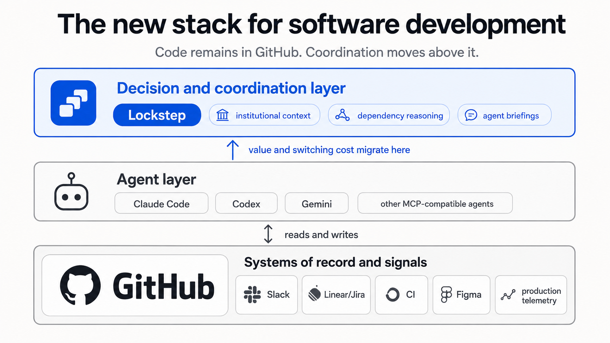

<p align="center"><strong>Lockstep</strong></p>

<h3 align="center">Stop your team's AI coding agents from making conflicting decisions.</h3>

<p align="center">Lockstep is the shared decision record every agent reads before it acts.</p>

<p align="center">
  <a href="https://github.com/lockstep-team-agent/lockstep/actions/workflows/ci.yml"></a>
  <a href="https://www.npmjs.com/package/lockstep-cli"></a>
  <a href="./LICENSE"></a>
  
</p>

<p align="center">
  <a href="#quick-start"><b>Quick start</b></a> ·
  <a href="#how-it-works"><b>How it works</b></a> ·
  <a href="./DEPLOY.md"><b>Deploy</b></a>
</p>

<p align="center">
  
</p>

<!--
  Once recorded, the 25s two-developer demo GIF (storyboard in docs/DEMO.md) can join or replace the
  diagram above as the lead visual: 
-->

---

When two developers point AI coding agents at the same system, the agents have no idea what each other just did:

- **Agent A** renames `POST /login` → `POST /session`. **Agent B** keeps calling the old route — and ships it.
- **Agent A** decides "auth tokens are JWT, 15-min expiry." **Agent B** invents a conflicting scheme.
- Someone changes an endpoint three other services depend on. Nobody finds out until it breaks.

The thing that actually steers a codebase isn't the code — it's the **decisions**. Today those decisions live in people's heads, scattered Slack threads, and stale docs that no agent ever reads.

**Lockstep is GitHub for the decisions your AI agents make.** Every decision, change, and question is captured once and replayed to every agent that needs it — ranked by blast radius, so the important ones surface and the noise doesn't.

```bash
npm i -g lockstep-cli
```

### How it compares

|                                                       | Nothing | Slack / docs | CODEOWNERS  |          **Lockstep**          |
| ----------------------------------------------------- | :-----: | :----------: | :---------: | :----------------------------: |
| Agents learn what other agents decided                |   ❌    |    Manual    |     ❌      |          ✅ Automatic          |
| Decisions ranked by blast radius                      |   ❌    |      ❌      |     ❌      |        ✅ Usage graph          |
| Changes routed to the services that consume them      |   ❌    |      ❌      |     ❌      |       ✅ Dependency graph      |
| "Does anyone use this endpoint?" answered instantly   |   ❌    |    Manual    |   Partial   |       ✅ From the graph        |
| Works across agent vendors                            |    —    |      —       |      —      | ✅ Any MCP agent               |

## How It Works

A **decision** is the hero: a durable rule ("auth is JWT, 15-min expiry") or architectural choice that shapes future work. A **change** is a routine event — captured, but only surfaced when it matters.

```
  Dev A's agent                  Lockstep                       Dev B's agent
  ─────────────                  ────────                       ─────────────
  logs a decision  ───────▶  ┌─────────────────┐
  "auth → /session"          │  Decision ledger │
                             │  Usage graph     │  blast radius
  changes a surface ──────▶  │  Impact ranking  │  decides who
  POST /session              │  Inboxes         │  cares & how much
                             └────────┬─────────┘
                                      │  routes to the services that
                                      ▼  consume the changed surface
                              Dev B's next session begins with:
                              ⚠ [impact 3] auth: /login → /session (binding)
                              → B's agent uses /session before writing a line
```

1. **Capture** — A coding-agent hook diffs the working tree and publishes *changes* with a canonical surface ID (`http:POST /session`, `proto:auth.v1.Auth/Login`). When an agent makes a real decision, it logs it with `propose_decision`.
2. **Rank** — Each decision and change gets an **impact** score = how many services consume the affected surface (its blast radius). This is what keeps signal high and noise quiet.
3. **Route** — Changes fan out to exactly the repos that declared a dependency on the changed surface (`lockstep.yaml`). The agent can also ask `consumers("http:GET /orders/:id")` — *"does anyone use this?"* — and get an answer from the graph instead of pinging a human.
4. **Replay** — On session start, each agent receives a briefing of what changed and what's binding since it was last here, **highest blast radius first** — so it's aware before it acts.
5. **Bind** — Cross-cutting decisions (high impact) stay open until an affected team acknowledges them; own-area decisions bind on assertion. A PR-time gate fails any contract change with no binding decision.

## Quick Start

Get a working local setup in under 5 minutes — no GitHub App keys needed.

> **Managed cloud is coming soon.** For now, run it locally or self-host (below).

### 1. Start the stack

```bash
git clone https://github.com/lockstep-team-agent/lockstep.git
cd lockstep
cp .env.example .env        # dev-login is enabled by default
docker compose up --build   # starts Postgres + API + dashboard
```

Wait for `lockstep-core listening on :8080`, then verify:

```bash
curl http://localhost:8080/readyz   # => { "ok": true, "db": "up" }
```

This gives you the **API** at `:8080`, the **dashboard** at `:3000`, and **Postgres** at `:5432`.

### 2. Install the CLI & log in

```bash
npm i -g lockstep-cli
lockstep login --api http://localhost:8080 --dev --dev-id 1 --dev-login alice
```

### 3. Connect your repo & declare what it consumes

```bash
cd your-project              # any git repo with an origin remote
lockstep init                # installs the MCP server + hooks
lockstep connect --project "my-team"
```

Add a `lockstep.yaml` at the repo root listing the surfaces this repo depends on — this is what makes Lockstep warn you (ranked by blast radius) when a teammate changes one. See [`lockstep.example.yaml`](./lockstep.example.yaml).

```yaml
consumes:
  - http:POST /auth/session     # canonical IDs — producer & consumer use the SAME string
  - proto:billing.v1.Billing/Charge
```

### 4. Start coding

Open Claude Code (or any MCP agent) in the repo. On session start, the agent receives a Lockstep briefing of everything that changed since it was last here — impact-ranked — and respects every binding decision. As you work, contract changes are captured and routed to teammates automatically.

> **Production**: register a GitHub App and set `NODE_ENV=production`, `LOCKSTEP_DEV_LOGIN=0`. See [DEPLOY.md](./DEPLOY.md).

## What flows through Lockstep

| Object       | What it is                                                              |
| ------------ | ----------------------------------------------------------------------- |
| **Decision** | A durable rule or architectural choice. The hero. Impact-ranked, versioned (CAS). |
| **Change**   | A routine event on a canonical surface. Routed to consumers by blast radius.      |
| **Question** | A cross-team ask, ideally answered from the ledger before a human is pinged.       |
| **Task**     | Delegated work, fanned out to the assignee's inbox.                                |

## Agents & integration

Works with **any MCP-compatible agent**. Auto-capture hooks ship for **Claude Code** today; Codex and Gemini adapters are on the roadmap. The 13-tool MCP server runs per-session on the developer's machine and is identical across vendors — new integrations are a single adapter file.

## CLI Commands

| Command                               | What it does                                               |
| ------------------------------------- | ---------------------------------------------------------- |
| `lockstep login [--api <url>]`        | Authenticate via GitHub device flow (or `--dev` for local) |
| `lockstep init`                       | Wire MCP server + hooks into the current repo              |
| `lockstep connect [--project <name>]` | Link this repo to a shared project                         |
| `lockstep invite <github-handle>`     | Invite a teammate to your project                          |
| `lockstep status` / `lockstep doctor` | Check auth + config health                                 |

## Project Structure

```
packages/core/   # Fastify API + PostgreSQL (Drizzle ORM), RLS-isolated, append-only ledger
packages/cli/    # lockstep-cli — login, init, connect, capture, MCP server
packages/web/    # Next.js dashboard — decisions, contracts, dependencies, activity
actions/pr-check # GitHub Action — PR-time reconciliation gate
```

## Learn more

- [Deploy](./DEPLOY.md) · [Contributing](./CONTRIBUTING.md) · [Security](./SECURITY.md) · [Changelog](./CHANGELOG.md)
- Architecture: 26-table schema with row-level security, append-only CAS-versioned decision ledger, vendor-neutral MCP adapters, Zod validation on every boundary, TypeScript strict throughout. Self-host with `docker compose` or deploy to Railway.

## License

[Apache 2.0](./LICENSE) &copy; 2026 Naman Jain
