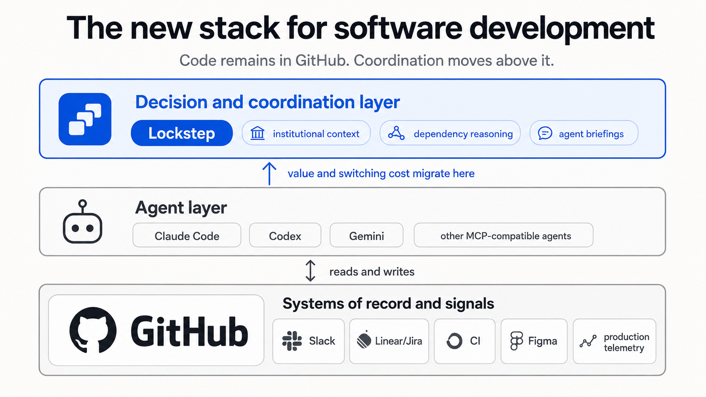

<p align="center"><strong>Lockstep</strong></p>

<h3 align="center">Keep decisions consistent. Turn product briefs into clear implementation context.</h3>

<p align="center">Start with one developer or one product manager. Grow into a shared decision record for your team.</p>

<p align="center">
  <a href="https://github.com/lockstep-team-agent/lockstep/actions/workflows/ci.yml"></a>
  <a href="https://www.npmjs.com/package/lockstep-cli"></a>
  <a href="./LICENSE"></a>
  <a href="https://glama.ai/mcp/servers/lockstep-team-agent/lockstep"></a>
  
</p>

<p align="center">
  <a href="https://www.getlockstep.dev"><b>Website</b></a> ·
  <a href="https://lockstep-dashboard.up.railway.app"><b>▶ Try it live</b></a> ·
  <a href="#quick-start"><b>Quick start</b></a> ·
  <a href="#for-product-managers"><b>For product managers</b></a> ·
  <a href="#how-it-works"><b>How it works</b></a> ·
  <a href="./DEPLOY.md"><b>Deploy</b></a>
</p>

---

Yesterday, you and Claude renamed `POST /login` to `POST /session`. Today, a fresh session writes a client against the old route. The decision was made; the next session never received it.

Lockstep gives developers and product managers two ways to start independently:

- **Developers:** keep accepted decisions across Claude Code sessions and check whether changed code may contradict them.
- **Product managers:** turn a product brief into reviewed requirements, track revisions, and copy a useful implementation brief before a developer joins.
- **Teams:** share the same ledger, route interface changes to affected services, and retain existing integrations, permissions, and PR enforcement.

For example, accept “exports expire after 24 hours, except internal previews.” A later Claude session receives that decision without another explanation. A PM can trace the requirement to its source, revise it for review, and share its accepted version with a developer.

Start with one real repo or brief. Invite a colleague when there is useful context to share; company-wide onboarding is not required.

<p align="center">
  
</p>

<!--
  Once recorded, the 25s two-developer demo GIF (storyboard in docs/DEMO.md) can become the lead visual,
  moved above the problem statement: 
-->

```bash
npx lockstep-cli onboard
```

### How it compares

|                                                     | Nothing | Slack / docs | CODEOWNERS |         **Lockstep**          |
| --------------------------------------------------- | :-----: | :----------: | :--------: | :---------------------------: |
| Agents learn what other agents decided              |   ❌    |    Manual    |     ❌     |         ✅ Automatic          |
| Decisions ranked by blast radius                    |   ❌    |      ❌      |     ❌     |        ✅ Usage graph         |
| Changes routed to the services that consume them    |   ❌    |      ❌      |     ❌     |      ✅ Dependency graph      |
| "Does anyone use this endpoint?" answered instantly |   ❌    |    Manual    |  Partial   |       ✅ From the graph       |
| Claude Code session continuity                      |    —    |    Manual    |     —      | ✅ Briefings + decision packs |

## How It Works

Start with your own next session:

```text
You accept: “Use POST /session; POST /login is retired.”
    → Lockstep keeps the accepted decision.
    → Your next Claude session receives it before you start coding.
    → An opted-in check can flag changed code that may contradict it.
```

A **decision** is a durable rule or architectural choice that shapes future work. A **change** is a routine event — captured, but only surfaced when it matters. A PM can establish the same continuity by reviewing requirements from a brief before any code is connected.

### As teammates join

The same ledger grows into coordination across developers and repos. For example, a route change in one service can reach the developers whose services consume it:

```
  Dev A's agent                  Lockstep                       Dev B's agent
  ─────────────                  ────────                       ─────────────
  logs a decision  ───────▶  ┌─────────────────┐
  "auth → /session"          │  Decision ledger │
                             │  Usage graph     │  blast radius
  changes a surface ──────▶  │  Impact ranking  │  decides who
  POST /session              │  Inboxes         │  cares & how much
                             └────────┬─────────┘
                                      │  routes to the services that
                                      ▼  consume the changed surface
                              Dev B's next session begins with:
                              ⚠ [impact 3] auth: /login → /session (binding)
                              → B's agent uses /session before writing a line
```

1. **Capture** — A coding-agent hook diffs the working tree and publishes _changes_ with a canonical surface ID (`http:POST /session`, `proto:auth.v1.Auth/Login`). When an agent makes a real decision, it logs it with `propose_decision`.
2. **Rank** — Each decision and change gets an **impact** score = how many services consume the affected surface (its blast radius). This is what keeps signal high and noise quiet.
3. **Route** — Changes fan out to exactly the repos that declared a dependency on the changed surface (`lockstep.yaml`). The agent can also ask `consumers("http:GET /orders/:id")` — _"does anyone use this?"_ — and get an answer from the graph instead of pinging a human.
4. **Replay** — On session start, each agent receives a briefing of what changed and what's binding since it was last here, **highest blast radius first** — so it's aware before it acts.
5. **Bind** — Cross-cutting decisions (high impact) stay open until an affected team acknowledges them; own-area decisions bind on assertion. A PR-time gate fails any contract change with no binding decision.

## Quick Start

Choose your starting point: [developer](#for-developers) or [product manager](#for-product-managers). Both use the full dashboard and the same project history.

<!-- Release maintenance: after hosted rollout, verify both entry paths and a real authenticated Claude session, then replace this pending note with the verified status. -->

> **Pilot release status:** CLI **0.3.0** is published on npm and listed in the MCP registry, alongside the matching API and dashboard changes in this repository. Hosted rollout and a real authenticated Claude-session verification are still pending, so the hosted links may run an earlier release. Complete those checks before inviting pilot participants.

### For developers

Requires Node.js 20+, Claude Code, a GitHub account, and a Git repo with an `origin` remote.

```bash
cd your-project
npx lockstep-cli onboard
```

1. **Preview locally.** Inspect candidate documentation and proposed Claude configuration changes before approving setup. Select which documents to upload, or skip import and enter a decision manually.
2. **Connect, scan, and review.** Sign in with GitHub and connect the intended project. Onboarding runs `scan --apply`: it writes or merges `lockstep.yaml`, preserving existing entries, and seeds the graph with detected produced surfaces and matched dependencies. Then review up to five decision proposals. Remaining drafts stay in **Review**. Imports do not become accepted decisions automatically.
3. **Choose hosted checks separately.** Automatic code checks have their own remembered opt-in. Declining them leaves decision continuity available.
4. **Open Claude Code.** Approve the project MCP server when prompted. Onboarding distinguishes **configured**, **connected**, **decisions ready**, and **agent verified**. Use `npx lockstep-cli status` to inspect configuration and recorded agent verification. Configuration alone is not activation.
5. **Return, share, and invite.** Later sessions receive current decisions and relevant updates. Use the dashboard's **Preview decision brief** → **Copy decision brief**, or print Markdown with `npx lockstep-cli brief`. When the scan finds outbound calls with no declared producer and relevant Git history, onboarding also suggests recent contributors to the calling files and prints an invite command.

For example, an unmatched `http:POST /billing/charge` call in `src/checkout.ts` can point you to a colleague who recently edited that file. These are leads to ask about the missing dependency, not verified owners; an unmatched call may also target an external service. Confirm the GitHub handle and invite each person you choose:

```bash
npx lockstep-cli invite <github-handle>
```

Suggestions do not send invitations automatically. You can share a useful brief with the colleague first.

```bash
npx lockstep-cli onboard --dry-run    # preview without configuring or uploading
npx lockstep-cli check --upload       # explicitly authorize this one working-diff check
npx lockstep-cli check --base main --upload
npx lockstep-cli checks on            # enable automatic hosted checks for this checkout
npx lockstep-cli checks off           # disable them independently of the ledger
```

For non-interactive runs, authenticate first and use `--yes` to proceed beyond preview:

```bash
npx lockstep-cli onboard --yes --no-docs --disable-checks
npx lockstep-cli onboard --yes --upload-docs --docs CLAUDE.md,docs/adr/auth.md --disable-checks
```

`--yes` approves setup; it does not authorize document uploads or enable hosted checks. `--no-docs` skips documentation import, while `--upload-docs` explicitly authorizes uploading the selected candidate documents (`--docs` narrows that selection). Neither skips the repository scan and graph setup. Non-interactive imports remain drafts for dashboard review. Use `--enable-checks` or `--disable-checks` to set check consent explicitly; otherwise saved consent is retained.

Checks are advisory and report **completed**, **partial**, **skipped**, or **unavailable**. Missing providers or applicable rules do not produce a pass. Automatic checks have a six-second API deadline and never block Claude. Raw diff hunks are processed transiently; stored results contain status, decision references, locations, and feedback.

Onboarding respects `LOCKSTEP_API_URL` and saved API settings; hosted is the default only when neither exists. Generated Claude commands use a version-pinned npm invocation, so a global Lockstep installation is unnecessary. Decision packs stay local and Git-ignored.

### For product managers

**Start with a brief, without a repo, CLI, or developer.** Sign in with GitHub at the [dashboard](https://lockstep-dashboard.up.railway.app), then:

1. **Create a project.** Use **Start with one product brief** on the dashboard home page. New pilot projects enable the product layer; joining an existing project preserves its settings.
2. **Paste your brief in Sources.** Give it a title and, optionally, a feature reference such as `feature:private-exports`. Save it and inspect the extracted requirements alongside their source evidence. If extraction is unavailable, open the saved brief and use **Select requirements manually** to choose exact source passages.
3. **Review and ratify.** Inspect the source, set its state to **active** when ready, and edit, reject, or ratify requirements through **Review** and **Decisions**. Drafts and questions remain distinct from accepted requirements.
4. **Use the implementation brief.** Open the source and choose **Preview implementation brief**, review the Markdown, then **Copy implementation brief**. It includes accepted requirements, rationale and source references, drafts, unresolved questions, and recorded concerns. You have a useful handoff before anyone installs Lockstep.
5. **Revise with history.** Edit the saved source when the product brief changes. Previous source versions remain available; changed requirements return to review before the accepted brief is regenerated. Pasted briefs are **manually maintained**, not synchronized with an external document.
6. **Invite a developer when ready.** Use **Members & Repos** to invite their GitHub handle to this exact project. Share the brief and its project/feature connection command. Their Claude sessions can then receive the relevant ratified requirements.

For example, a PM can start with “exports expire after 24 hours; internal previews are exempt; bulk downloads are out of scope.” Review those requirements, leave “Should expiry be configurable?” as an unresolved question, and copy the implementation context before involving engineering.

Once development is connected, use the existing decision, feature, check, and activity views to review recorded context and concerns. **Delivered requirements and no recorded concerns do not mean a feature is complete.** Useful-concern, false-positive, and intentional-exception feedback does not silently change a decision.

Copying Markdown does not publish it, send a message, or grant access. Dashboard links remain authenticated. A product colleague joining a developer-created project uses the same dashboard and ledger, with no CLI setup.

### Join an existing project

After the project owner invites your GitHub handle, sign in again to activate the invitation. Developers connect their repo to the supplied project ID:

```bash
npx lockstep-cli onboard --project-id <project-id> --feature feature:private-exports
```

Omit `--feature` when no feature is selected. This reuses the project's ledger and history. Each developer installs personal Claude hooks; product colleagues work in the dashboard.

### For teams and self-hosting

Existing B2B integrations, roles, review requirements, and GitHub PR checks remain available. The new semantic code checks are advisory; they do not replace the existing contract gate. The individual pilot starts with Claude Code; other adapters are deferred.

Onboarding already runs `scan --apply` to establish `lockstep.yaml` and seed the surface graph. When routes or dependencies change, use `npx lockstep-cli scan` to preview updates and `npx lockstep-cli scan --apply` to merge and sync them. The standalone command also retries a scan that was incomplete during onboarding. See [`lockstep.example.yaml`](./lockstep.example.yaml). Independent `login`, `init`, `connect`, `scan`, and `pack` commands remain available.

<details>
<summary><b>Self-host with Docker</b></summary>

```bash
git clone https://github.com/lockstep-team-agent/lockstep.git
cd lockstep
cp .env.example .env
docker compose up --build   # Postgres + API (:8080) + dashboard (:3000)
```

Point the CLI at your server:

```bash
npx lockstep-cli login --api http://localhost:8080
```

For local development with the dev-login bypass enabled, use:

```bash
npx lockstep-cli login --api http://localhost:8080 --dev --dev-id 1 --dev-login alice
```

The API needs an extraction provider (`ANTHROPIC_API_KEY`, or the existing `TYPESAFE_API_KEY` provider) for automatic imports, and `TYPESAFE_API_KEY` for advisory checks. Manual requirements remain usable without extraction. Set `LOCKSTEP_CHECKS_ENABLED=0` to disable semantic checking server-side without disabling the ledger or existing B2B PR checks.

For production, configure real GitHub authentication, set `NODE_ENV=production` and `LOCKSTEP_DEV_LOGIN=0`, apply migrations, and verify provider configuration, request limits, backups, and both onboarding paths. See [DEPLOY.md](./DEPLOY.md).

</details>

## What flows through Lockstep

| Object       | What it is                                                                        |
| ------------ | --------------------------------------------------------------------------------- |
| **Decision** | A durable rule or architectural choice. The hero. Impact-ranked, versioned (CAS). |
| **Change**   | A routine event on a canonical surface. Routed to consumers by blast radius.      |
| **Question** | A cross-team ask, ideally answered from the ledger before a human is pinged.      |
| **Task**     | Delegated work, fanned out to the assignee's inbox.                               |

## Agents & integration

The individual pilot supports **Claude Code only**, with session-start briefings, MCP tools, local decision packs, and optional completion checks. Explicit CLI/MCP operations remain available if hooks are unavailable. No model calls run after every edit.

The ledger remains vendor-neutral and the existing team integrations are retained. Codex and other individual-onboarding adapters are deferred.

## CLI Commands

Use `npx lockstep-cli <command>` without installing a global binary, or `lockstep <command>` if installed globally.

| Command                                          | What it does                                                                               |
| ------------------------------------------------ | ------------------------------------------------------------------------------------------ |
| `onboard [--project-id <id>] [--dry-run]`        | Preview inputs, connect, scan the repo, review decisions, and configure Claude             |
| `onboard --yes --no-docs`                        | Proceed past setup confirmation and skip documentation import                              |
| `onboard --yes --upload-docs [--docs <paths>]`   | Approve setup and document upload; optionally narrow candidates with comma-separated paths |
| `login [--api <url>]`                            | Authenticate with GitHub and optionally save your server                                   |
| `init --vendor claude`                           | Configure Claude independently of onboarding                                               |
| `connect [--project <name>] [--project-id <id>]` | Create or join the intended project                                                        |
| `scan [--apply]` / `sync`                        | Preview/apply a dependency manifest, or sync the existing manifest                         |
| `pack [--check]`                                 | Refresh the local decision pack or check its freshness                                     |
| `check [--base <revision>] [--upload]`           | Check tracked changes against relevant accepted decisions                                  |
| `checks on` / `checks off`                       | Enable or revoke automatic hosted diff checks                                              |
| `brief`                                          | Print a copyable project decision brief                                                    |
| `invite <github-handle>`                         | Invite a colleague to the connected project                                                |
| `status` / `doctor`                              | Inspect configuration, connection, and verification status                                 |
| `uninstall [--dry-run]`                          | Remove Lockstep-managed Claude entries while retaining ledger history                      |

## Project Structure

```
packages/core/   # Fastify API + PostgreSQL (Drizzle ORM), RLS-isolated, append-only ledger
packages/cli/    # lockstep-cli — onboarding, continuity, advisory checks, MCP server
packages/web/    # Next.js dashboard — briefs, review, decisions, features, team workflows
actions/pr-check # GitHub Action — PR-time reconciliation gate
```

## Learn more

- [Deploy](./DEPLOY.md) · [Contributing](./CONTRIBUTING.md) · [Security](./SECURITY.md) · [Changelog](./CHANGELOG.md)
- Built on row-level-security Postgres, an append-only CAS-versioned decision ledger, and vendor-neutral MCP adapters. Self-host with `docker compose` or deploy to Railway.

## License

[Apache 2.0](./LICENSE) &copy; 2026 Naman Jain
